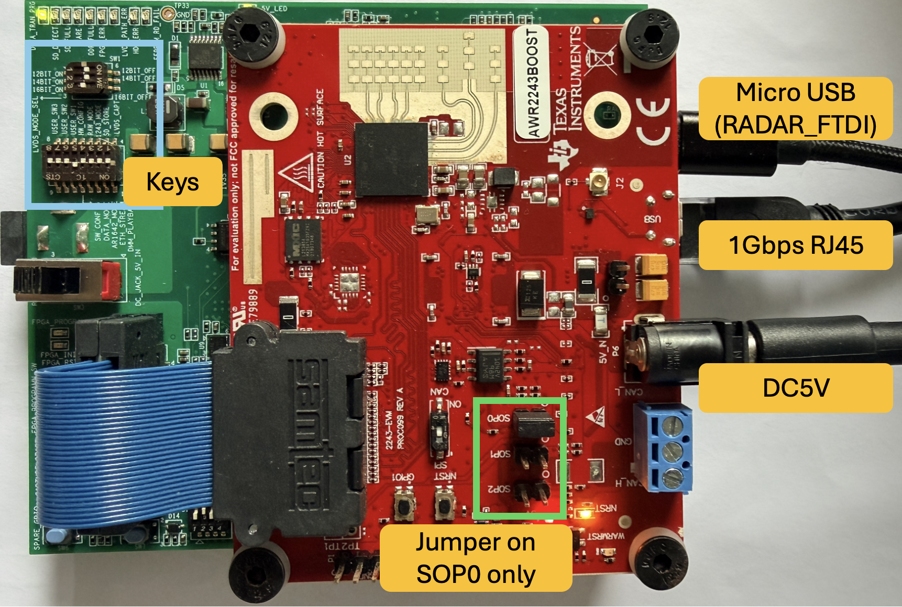

# OpenRawRadar

[]()
[]()
[]()
[]()
[](LICENSE)

**OpenRawRadar** is a **full-C++, cross-platform** raw ADC capture toolkit for the **TI AWR2243 + DCA1000EVM** mmWave radar pair. It can sustain the DCA1000EVM's full **~700 Mbps** capture rate and provides a unified pipeline from hardware bring-up to standalone CLI capture, **ROS 2** streaming, **Docker** deployment, bag recording, post-processing, and visualization.

> **Acknowledgement.** OpenRawRadar is inspired by and partially derived from [`gaoweifan/pyRadar`](https://github.com/gaoweifan/pyRadar). Compared to pyRadar, this project is rewritten in C++ for high-throughput streaming, adds ROS 2 / Docker / Foxglove integration, and **only supports the AWR2243** front end.

> **Note: OpenRawRadar** is a part of our multi-modal testbed `SYNOVA`.
## ✨ Features

- 🚀 **Native C++ capture** — high-throughput data streaming, sustains DCA1000EVM's full ~700 Mbps
- 🪟🐧 **Cross-platform CLI** — Linux and Windows supported
- 🔧 **Configurable network stack** — scripted macvlan that bypasses DCA1000EVM's hard-coded IP / subnet restriction
- 🧰 **Two capture modes** — standalone CLI (no ROS dependency) and ROS 2 publisher
- 🐳 **Docker-ready** — containerized ROS 2 stack
- 📦 **Rosbag tooling** — record with `mcap`, convert to `h5` / `bin`
- 🖼️ **Foxglove integration** — built-in `foxglove_bridge` for live visualization

## 📁 Repository Layout

| Path             | Description |
|------------------|-------------|
| `cli/`           | Standalone non-ROS C++ capture program and post-process scripts |
| `ros_workspace/` | ROS 2 workspace, including `radar_driver_cpp` package |
| `parser_tool/`   | Rosbag → `h5` / `bin` conversion and RD-map rendering |
| `configs/`       | Shared radar (`AWR2243_*.txt`) and DCA (`dca_config.txt`) configs |
| `output/`        | Default output directory for bags, CLI captures, and exports |
| `asserts/`       | Documentation images |

---

# 🔌 Hardware

<p align="center">
  
</p>

1. Connect the **micro-USB** and **RJ45** cables, and set the **key / SOP** jumpers as shown in the diagram above.
2. Set the power connector on the **DCA1000EVM** to **`RADAR_5V_IN`**.
3. Connect the **AWR2243** to a **5 V barrel jack** (5 V / 3 A recommended).
---

# 💻 Software

## Support Matrix

| | **CLI** | **ROS 2 (bare metal)** | **Docker + ROS 2** |
|---|---|---|---|
| **Windows** | ✅ Capture → `adc_data.bin` + `.json`<br>✅ Offline RD-map (Python)<br>❌ Live visualization | ❌ Not supported | ❌ Not supported |
| **Linux (Ubuntu 22.04)** | ✅ Capture → `adc_data.bin` + `.json`<br>✅ Offline RD-map MP4 | ✅ Live topics (raw chunk, `rd_map`, `points`)<br>✅ Bag record (`mcap`)<br>✅ Foxglove live viz<br>✅ Bag → `h5` / `bin` / RD-map MP4 | ✅ All bare-metal ROS 2 features<br>✅ Fully containerized stack<br>✅ macvlan bypasses DCA1000EVM IP lock |

---

## 🐧 Linux

### System requirements

[]()
[]()
[]()

> Verified on Ubuntu 22.04 + ROS 2 Humble + Docker 27.5. Docker is only required for the Docker workflow.

### Set environment variables

```bash
cp .env.example .env
```

Set host user mapping for Docker bag recording:

```bash
LOCAL_UID=$(id -u)
LOCAL_GID=$(id -g)
```

Key variables in `.env`:
- `SUBNET`
- `RADAR_PARENT_IFACE`
- `RADAR_HOST_SUFFIX`
- `RADAR_BOARD_SUFFIX`
- `LOCAL_UID`
- `LOCAL_GID`

You can also override any variable listed in `.env` from the shell with `export VAR=value` before running.


### Network Preparation

Tune the NIC (if packet drops occur at high throughput):

```bash
sudo bash ./network_config.sh <parent_iface> [ring_size|auto] [mtu] [socket_buffer] [backlog]
# Example: sudo bash ./network_config.sh enp5s0 auto 9000
```

Create the macvlan shim (only required for Docker workflows):

```bash
sudo bash ./macvlan_config.sh <parent_iface> <subnet>
# Example: sudo bash ./macvlan_config.sh enp5s0 33
```

> **Note**: For docker, the host IP can be any address outside the macvlan subnet.

> **Note**: For cli and bare-metal ROS 2, the host IP must be set to `192.168.<SUBNET>.<RADAR_HOST_SUFFIX>` (default `192.168.33.30`)

> **Note**: Both scripts use **parameter-first precedence**. If parameters are omitted, they fall back to `SUBNET` and `RADAR_PARENT_IFACE`.

**Derived network defaults:**
- gateway: `192.168.<SUBNET>.1`
- radar host / container IP: `192.168.<SUBNET>.<RADAR_HOST_SUFFIX>` (default `.30`)
- DCA1000 board IP: `192.168.<SUBNET>.<RADAR_BOARD_SUFFIX>` (default `.180`)
- bag container IP: `192.168.<SUBNET>.201`

For bare-metal ROS 2 or CLI, set the dedicated host NIC to the host IP above. For Docker, the `radar` container claims that host IP via macvlan.

---

### 🐧 Linux · CLI (standalone w/o ROS 2)

#### 1. Build

```bash
cd cli
cmake -S . -B build
cmake --build build -j
```

#### 2. (One-time) Firmware download for new radars

```bash
sudo -E bash -lc '
./build/open_raw_radar_firmware_download
'
```

#### 3. Run capture

```bash
sudo -E bash -lc '
./build/open_raw_radar_capture \
  --radar-config-filename AWR2243_mmwaveconfig_max15.txt \
  --dca-config-filename dca_config.txt \
  --subnet 33 \
  --host-suffix 30 \
  --board-suffix 180 \
  --max-frames 10
'
```

Output defaults to `output/cli_YYYY_MM_DD-HH_MM_SS/`.

Each capture folder contains:
- `adc_data.bin` — raw ADC samples
- `adc_data.json` — capture metadata
- `capture.log` — runtime log

#### 4. Convert / visualize the capture

Render RD-map frames and an MP4 from the **latest** CLI capture:

```bash
./cli/process_bin.sh
```

Render from a **specific** CLI capture folder:

```bash
./cli/process_bin.sh --cli-output-path output/cli_YYYY_MM_DD-HH_MM_SS
```

---

### 🐧 Linux · Bare-metal ROS 2

#### 1. Build the workspace

```bash
source /opt/ros/humble/setup.bash
cd ros_workspace
colcon build
source install/setup.bash
```

#### 2. Run capture (Terminal 1, as `root`)

```bash
cd ros_workspace
sudo -E bash -lc '
source /opt/ros/humble/setup.bash
source install/setup.bash
export ROS_DOMAIN_ID=0
export RMW_IMPLEMENTATION=rmw_fastrtps_cpp
export FASTDDS_BUILTIN_TRANSPORTS=UDPv4
export ROS_LOCALHOST_ONLY=0
export ROS_LOG_DIR=/tmp/.ros/log
export SUBNET=33
export RADAR_HOST_SUFFIX=30
export RADAR_BOARD_SUFFIX=180
ros2 launch src/radar_driver_cpp/launch/radar_cpp.launch.py
'
```

#### 3. Record the bag (Terminal 2, as your normal user)

```bash
source /opt/ros/humble/setup.bash
cd ros_workspace
source install/setup.bash
export ROS_DOMAIN_ID=0
export RMW_IMPLEMENTATION=rmw_fastrtps_cpp
export FASTDDS_BUILTIN_TRANSPORTS=UDPv4
export ROS_LOCALHOST_ONLY=0
cd ../output
ros2 bag record -s mcap --all
```

> **Why two terminals / two users?**
> - `ros2 launch` stays on `root` for raw socket access to the radar / DCA path.
> - `ros2 bag record` stays on your normal user so `output/rosbag2_*` remains removable.
> - If you change `ROS_DOMAIN_ID`, set the same value in both terminals.
> - `FASTDDS_BUILTIN_TRANSPORTS=UDPv4` avoids the common same-host shared-memory issue where topics are discoverable but data is not delivered between `root` and non-root processes.

#### 4. (Optional) Foxglove live visualization

Install the system package:

```bash
sudo apt-get update
sudo apt-get install -y ros-humble-foxglove-bridge
```

Make sure `enable_processing:=true` is set in the radar launch file to publish `rd_map` and `points` topics for visualization:

```bash
sudo -E bash -lc ' 
... # same as Terminal 1
ros2 launch src/radar_driver_cpp/launch/radar_cpp.launch.py enable_processing:=true
```

Start `foxglove_bridge` in a third terminal:

```bash
cd ros_workspace
source /opt/ros/humble/setup.bash
source install/setup.bash
export ROS_DOMAIN_ID=0
export RMW_IMPLEMENTATION=rmw_fastrtps_cpp
export FASTDDS_BUILTIN_TRANSPORTS=UDPv4
export ROS_LOCALHOST_ONLY=0
ros2 launch foxglove_bridge foxglove_bridge_launch.xml port:=8765 address:=0.0.0.0
```
> Note: `enable_processing:=true` is only recommended when debugging due to heavy compute load and network burden.

In Foxglove Desktop, connect to:

```text
ws://localhost:8765
```

#### 5. Convert / visualize the rosbag

Convert the **latest** `rosbag2_*` under `./output`:

```bash
./convert_bag.sh
```

Defaults: latest bag under `./output`, format `both`, output `<rosbag2_dir>/export`.

Convert a **specific** bag:

```bash
./convert_bag.sh --bag-path /path/to/rosbag2_YYYY_MM_DD-HH_MM_SS
```

`--format` supports `h5`, `bin`, or `both` (default).

The export folder contains:
- `data.h5` — when `h5` is enabled
- `adc_data.bin` + `adc_data.json` — when `bin` is enabled
- `rd_map_frames_*/` — rendered PNG frames
- `rd_map_*.mp4` — rendered animation

---

### 🐧 Linux · Docker + ROS 2

#### 1. Build the base image

```bash
docker build -f Dockerfile.base -t ros2-base-image .
```

#### 2. Bring up containers

Start all containers in detached mode with build:

```bash
docker compose up -d --build
```

> **Note**: By default the Docker `radar` service starts with `enable_processing:=false`, so it only publishes the raw radar chunk topic. To also publish `rd_map` and `points` for Foxglove, set `enable_processing:=true` in [docker-compose.yml](./docker-compose.yml).

Stop collecting:

```bash
docker compose down --rmi all
```

#### 3. Connect Foxglove

```text
ws://192.168.<SUBNET>.220:8765
```

#### 4. Conversion / RD-map export

Use the same `./convert_bag.sh` as bare-metal ROS 2.

---

## 🪟 Windows

### Windows · CLI

ROS 2 and Docker workflows are **not supported** on Windows. Windows is supported for the standalone CLI capture path only.

#### 1. Install the FTDI driver

1. Install the official FTDI D2XX driver for your platform (only `amd64` is tested).
2. Open **Device Manager** and confirm the FTDI devices enumerate without a warning icon.
3. Copy the runtime DLL:
   - `amd64/ftd2xx64.dll` → `C:\Windows\System32\` and rename to `ftd2xx.dll`

#### 2. Build the CLI

With **Visual Studio 2022** (make sure you have CMake and the Visual Studio build tools installed):

```powershell
cd cli
cmake -S . -B build -G "Visual Studio 17 2022" -A x64
cmake --build build --config Release
```

#### 3. (One-time) Firmware download for new radars

```powershell
.\build\Release\open_raw_radar_firmware_download.exe
```

#### 4. Run capture

```powershell
.\build\Release\open_raw_radar_capture.exe `
  --radar-config-filename AWR2243_mmwaveconfig_max15.txt `
  --dca-config-filename dca_config.txt `
  --subnet 33 `
  --host-suffix 30 `
  --board-suffix 180 `
  --max-frames 10
```

Output folder layout (same as Linux): `output/cli_YYYY_MM_DD-HH_MM_SS/` containing `adc_data.bin`, `adc_data.json`, and `capture.log`.

#### 5. Convert / visualize the capture

Render RD-map frames from a specific capture:

```powershell
python3 process_bin.py --cli-output-path output\cli_YYYY_MM_DD-HH_MM_SS
# Or just run without args to process the latest capture
```

---

# 📄 License

OpenRawRadar is released under the [MIT License](LICENSE).

---

 ⭐ If you find this project useful, please consider giving it a **star** — it helps and is much appreciated!
